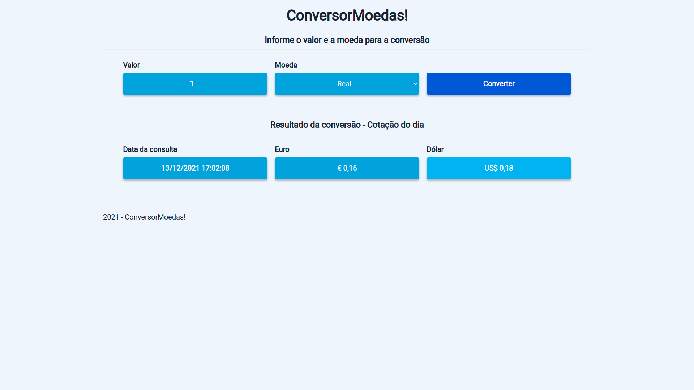

# ConversorMoedas!

O aplicativo ConversorMoedas! permite que você converta valores com a cotação atual das moedas Real, Dólar e Euro.

## Funcionalidaes

- Converta valores de Real para Dólar e Euro.
- Converta valores de Dólar para Euro e Real.
- Converta valores de Euro para Real e Dólar.

## Imagens do aplicativo

- Tela inicial
  

- Convertendo em Real
  

- Convertendo em Dolar
  

- Convertendo em Euro
  

## Tecnologias utilizadas

- [ReactJs](https://pt-br.reactjs.org/)
- [TypeScript](https://www.typescriptlang.org/)
- [Styled components](https://styled-components.com/)
- [Axios](https://axios-http.com/ptbr/)

## Clone este repositório para a sua máquina

```bash
git clone https://github.com/Cipriano99/ConversorMoedas
```

## Instale todas as dependências

```bash
#Com o npm
npm install #ou npm -i

#Com Yarn
yarn install #ou somente yarn
```

## Execute o ConversorMoedas! na sua máquina

```bash
#Com o npm
npm run start

#Com Yarn
yarn srtat
```

Após executar o comando acima, a aplicação irá abrir automaticamente no [http://localhost:3000](http://localhost:3000) no seu navegador padrão.

## Execute os testes unitários

```bash
#Com o npm
npm run test

#Com Yarn
yarn test
```

- Resutado dos testes
  
